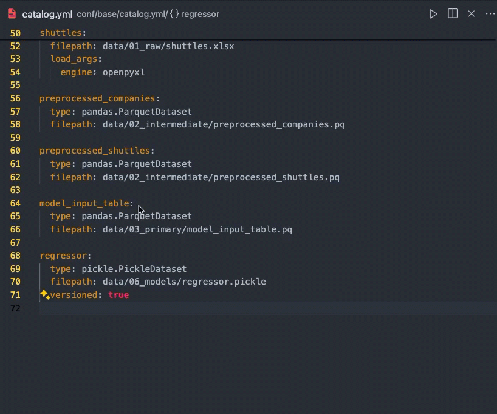
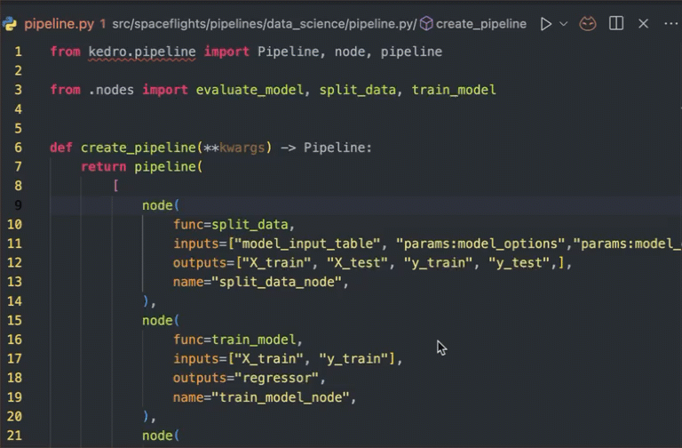

## Requirements

1. VS Code 1.64.0 or greater
1. Python extension for VS Code
1. `Python: select interpreter` - make sure you are using the correct virtual environment that you run your project.

The extension requires `bootstrap_project` in Kedro, you need to make sure you can do `kedro run` without getting any immediate error, otherwise you may get a server panic error.

## How to handle a server error
Click `Output` and select `Kedro` from the dropdown list. It may gives you some hints and report back if you think this is a bug.

Hit `Cmd` + `Shift` + `P` to open the VSCode command, look for `kedro: restart server` in case it's panic

# Feature
## Go to Definition from pipeline.py to configuration files
Use `Cmd` (Mac)/ `Ctrl` (Window) + `Click` or `F12` to trigger `Go to Definition`

## Go to Reference from configuration files to pipeline.py
- `Cmd` or `Ctrl` (Window) + `Click` on the definition.
- Use `Find Reference`
- Use the shortcut `Shift` + `F12`

## Autocompletion in Python
Type `"` in any `pipeline.py` and it should trigger the autocompletion list.

## Schema Validation

## Hover
Just hover your mouse over any `params:` or hit the command `Show or Focus Hover`
