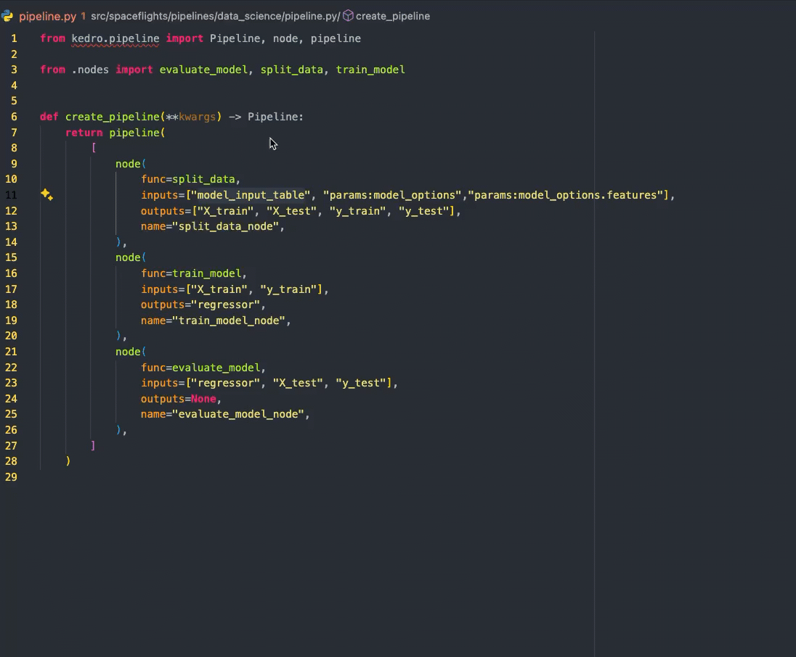
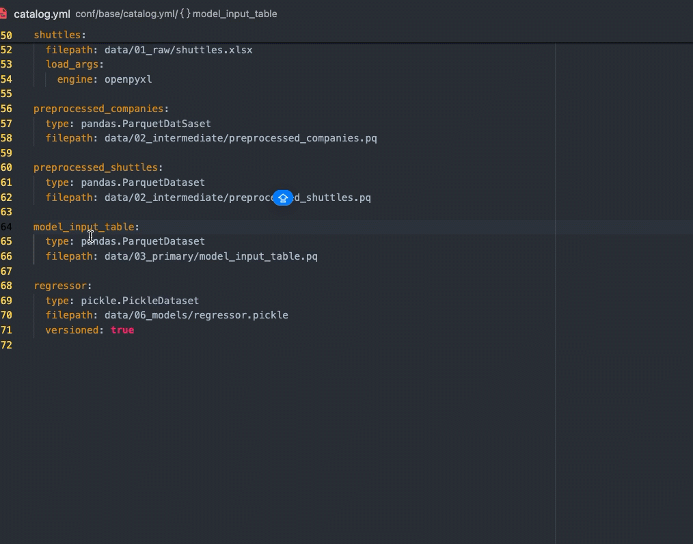
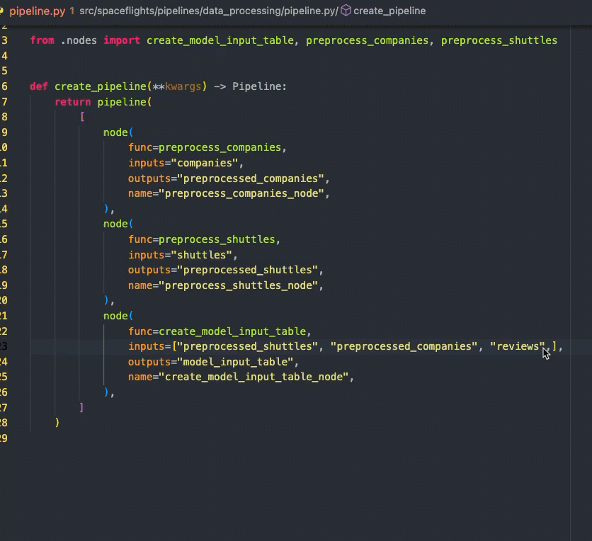

## Requirements

1. VS Code 1.64.0 or greater
1. Python extension for VS Code

The extension requires `bootstrap_project` in Kedro, you need to make sure you can do `kedro run` without getting any immediate error, otherwise you may get a server panic error.

# Feature
## Go to Definition from pipeline.py to configuration files
Use `Cmd` (Mac)/ `Ctrl` (Window) + `Click` or `F12` to trigger `Go to Definition`

## Go to Reference from configuration files to pipeline.py
Right click and trigger `Find Reference` or use the shortcut `Shift` + `F12`

## Autocompletion in Python
Type `"` in the editor and it should trigger the autocompletion list.

## Schema Validation
